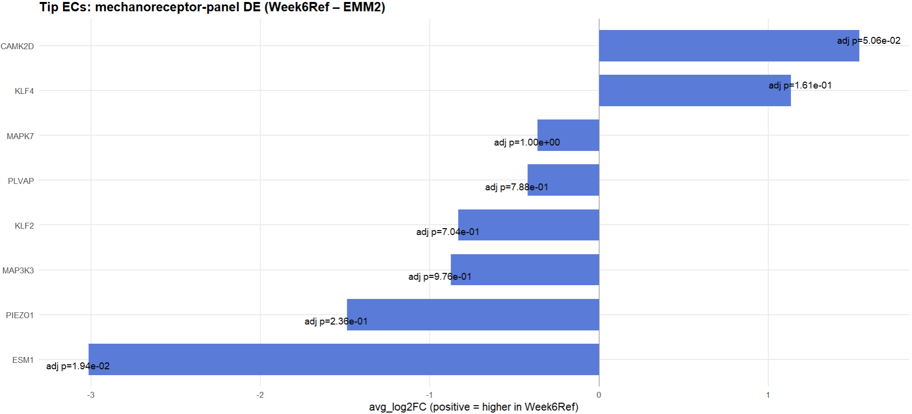

# OrganoidEC-Repo
This repository contains an independent single-cell RNA-seq analysis of human heart organoids (Aguirre lab EMM2/1 dataset, GSE218582) compared against a fetal heart endothelial reference (GSE106118). Note: EMM2 was used to abbreviate EMM2/1 throughout the analysis.

The work was motivated by Dr. Aguirre’s observation of reduced vascularization in EMM2 cardiac organoids, prompting a systematic analysis of endothelial cell subtype composition and mechanotransduction activity.

The pipeline was developed and executed independently, demonstrating the ability to reproduce and extend cutting-edge lab findings.

Workflow

1. Quality control – filtering cells by RNA content and technical metrics

2. Integration – batch correction and joint embedding of reference and organoid ECs

3. Subtype identification – annotation of endothelial subtypes at single-cell resolution

4. Tip EC–focused analysis – statistical comparison of abundance

5. Mechanotransduction pathway DE – differential expression of shear-responsive genes to assess maturation potential

Repository Structure

- Scripts/ – modular R scripts, organized in numbered order:

  - 01_load_qc.R – load data and perform QC

  - 02_gate_integrate_subtypes.R – endothelial gating, integration, and subtype annotation

  - 03_tip_tests.R – tip EC scoring and proportion analysis

  - 04_mech_panel_de.R – mechanotransduction panel differential expression

- Results/ – representative figures and outputs, organized in corresponding subfolders (01_qc, 02_integration_subtypes, etc.)
- data/ – placeholder for raw and processed data (not uploaded).

Figure Map

01_load_qc.R → QC_organoid.png, EMM2_QC.png

02_gate_integrate_subtypes.R → Endothelial_clusters.png, umap_condition.png, subtype_composition.png

03_tip_tests.R → tip_module_score.png, tip_proportion.png

04_mech_panel_de.R → mechno_transduction_DE.png

Conclusion

Result highlights include:

- Endothelial subtype composition differs between Week6Ref and EMM2 organoids.

- Elevated expression of ESM1 in organoid tip ECs

- Directional shifts in KLF4, CAMK2D, and PIEZO1 consistent with impaired laminar shear signaling

Single-cell RNA-seq analysis of EMM2 cardiac organoids revealed elevated PIEZO1 and ESM1 but marked downregulation of CAMK2D and KLF4 compared to the vascularized reference model. This transcriptional profile suggests that while endothelial cells retain mechanosensory capacity via PIEZO1, the Ca²⁺-driven signaling cascade required for flow-mediated transcriptional reprogramming is functionally impaired. Under physiological shear stress, PIEZO1 activation induces calcium influx that stimulates CAMK2D, leading to ERK5–KLF2/KLF4 activation, endothelial alignment, and the transition of migratory tip cells into quiescent stalk cells for proper vessel maturation (Zheng et al., 2022). The concurrent PIEZO1 upregulation and CAMK2D/KLF4 suppression in EMM2 organoids indicate a disconnect between mechanical sensing and transcriptional response, consistent with a static, low-shear environment. Elevated ESM1, a hallmark of tip-like, angiogenic endothelial states, further supports that endothelial maturation stalls before anastomosis. Collectively, these findings support the hypothesis that loss of Ca²⁺-CAMK2D signaling underlies incomplete mechanotransductive coupling, resulting in immature, non-perfusable vascular networks. Introducing flow-based conditioning or pulsatile microfluidic stimulation may restore this signaling axis and rescue vessel stabilization in vitro.

Notes

- Raw datasets are not included due to size restrictions. Scripts assume GEO accession numbers GSE106118 (fetal reference) and GSE218582 (cardiac organoids).

- This project was conducted independently, demonstrating my ability to design, execute, and interpret computational workflows to address biologically meaningful questions in organoid vascularization.
