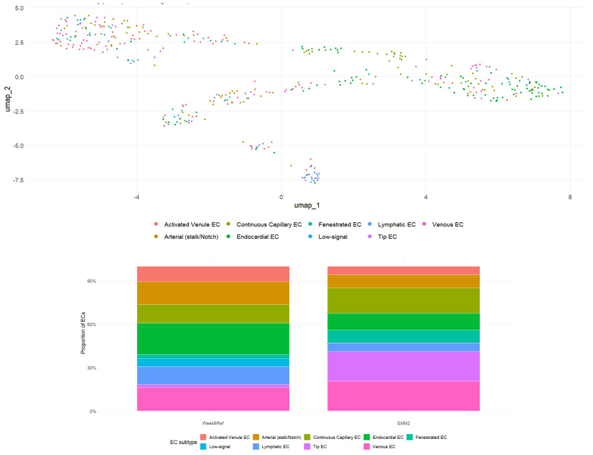

# OrganoidEC-Repo
This repository contains an independent single-cell RNA-seq analysis of human heart organoids (Aguirre lab EMM2 dataset, GSE218582) compared against a fetal heart endothelial reference (GSE106118).

The work was motivated by Dr. Aguirre’s observation of reduced vascularization in EMM2/1 cardiac organoids, prompting a systematic analysis of endothelial cell subtype composition and mechanotransduction activity.

The pipeline was developed and executed independently, demonstrating the ability to reproduce and extend cutting-edge lab findings.

Workflow

1. Quality control – filtering cells by RNA content and technical metrics

2. Integration – batch correction and joint embedding of reference and organoid ECs

3. Subtype identification – annotation of endothelial subtypes at single-cell resolution

4. Tip EC–focused analysis – statistical comparison of abundance and mechanotransduction scores

5. Mechanotransduction pathway DE – differential expression of shear-responsive genes to assess maturation potential

Repository Structure

- Scripts/ – modular R scripts, organized in numbered order:

  - 01_load_qc.R – load data and perform QC

  - 02_gate_integrate_subtypes.R – endothelial gating, integration, and subtype annotation

  - 03_tip_tests.R – tip EC scoring and proportion analysis

  - 04_mech_panel_de.R – mechanotransduction panel differential expression

- Results/ – representative figures and outputs, organized in corresponding subfolders (01_qc, 02_integration_subtypes, etc.)
- data/ – placeholder for raw and processed data (not uploaded; see Data Availability below).

Figure Map

01_load_qc.R → QC_organoid.png, EMM2_QC.png

02_gate_integrate_subtypes.R → Endothelial_clusters.png, umap_condition.png, subtype_composition.png

03_tip_tests.R → tip_module_score.png, tip_proportion.png

04_mech_panel_de.R → mechno_transduction_DE.png

Conclusion

Result highlights include:

- Endothelial subtype composition differs between Week6Ref and EMM2 organoids.

- Elevated expression of ESM1 in organoid tip ECs

- Directional shifts in KLF4, CAMK2D, and PIEZO1 consistent with impaired laminar shear signaling

These findings support a hypothesis that mechanotransduction deficits may underlie the reduced vascularization observed in EMM2 cardiac organoids.

Notes

- Raw datasets are not included due to size restrictions. Scripts assume GEO accession numbers GSE106118 (fetal reference) and GSE218582 (cardiac organoids).

- This project was conducted independently, demonstrating my ability to design, execute, and interpret computational workflows to address biologically meaningful questions in organoid vascularization.
